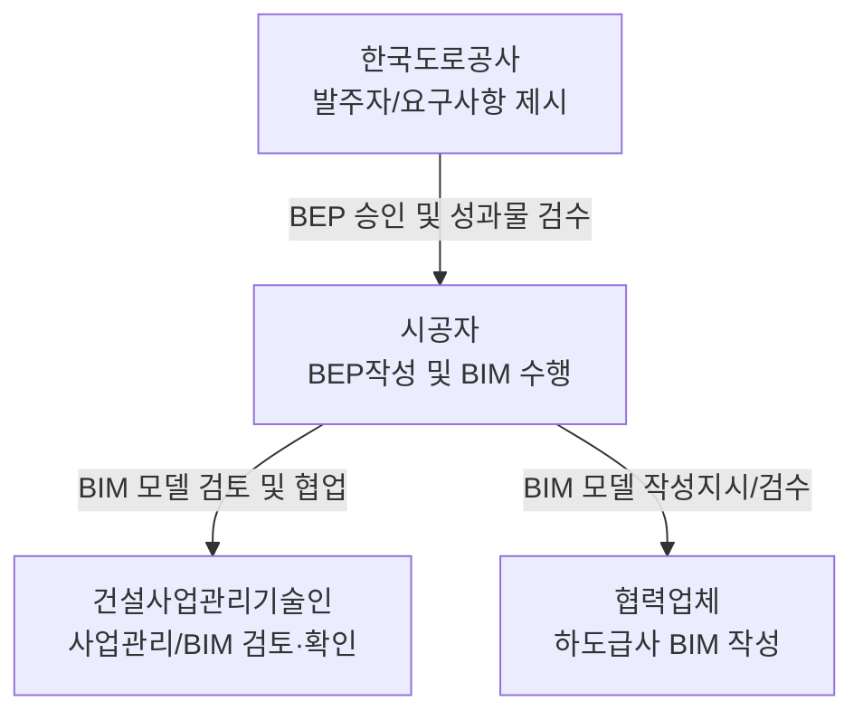

# 고속도로 시공상세도 및 BIM 지침 요약 보고서 (제1장 중심)

본 보고서는 고속도로 건설사업의 시공상세도 작성 및 BIM(건설정보모델링) 적용에 관한 주요 지침 3종의 제1장(개요 및 총칙) 내용을 비교·분석하여 체계적으로 정리한 문서입니다.

> [!NOTE]
> **대상 지침 목록**
> 1. **2012 지침**: 『2012.08 고속도로 시공상세도 작성지침』
> 2. **2023 지침**: 『2023.04 고속도로공사 BIM기반 시공상세설계정보물 작성지침 및 해설』
> 3. **시공자편 지침**: 『고속도로 BIM 적용지침 (시공자편)』

---

## 1. 지침 개요 및 목적 비교

세 지침은 도로공사 건설사업의 품질 향상과 안전 확보를 목표로 하지만, 기술의 발전(2D CAD → 3D BIM)과 디지털 전환 정책의 흐름에 따라 목적과 내용적 범위가 크게 확장되었습니다.

| 구분 | 2012 시공상세도 작성지침 | 2023 BIM기반 시공상세정보물 지침 | 고속도로 BIM 적용지침 (시공자편) |
| :--- | :--- | :--- | :--- |
| **핵심 목적** | 현장실정에 맞는 **2D 시공상세도** 작성을 통한 부실 설계·시공 방지 및 공사 품질 향상 | **BIM 기반 시공상세설계 정보물**의 작성, 제출, 승인 기준을 마련하여 스마트 건설 구현 | 시공 및 현장관리에 필요한 **시공자의 BIM 업무 방법 및 절차** 등의 구체적인 실행방안 제공 |
| **주요 법적 근거** | 건설기술관리법 제23조의2 동법 시행규칙 제14조의4 | 건설기술진흥법 제48조 제4항 동법 시행규칙 제42조 제2항 | 건설기술진흥법 제48조 제4항 건설산업 BIM 시행지침 등 상위 지침 준용 |
| **적용 범위** | 한국도로공사 관리 도로분야 건설사업 | 한국도로공사 관리 도로분야 건설사업 | 전면 BIM 설계가 적용된 고속도로 건설사업 우선 적용 |
| **성과물 형태** | 2D 종이 도면 (A3 규격 원칙), 계산서 | 3D 정보모델 + D/B, 시뮬레이션, 동영상, 2D 추출도면, 보조도면 | 3D 정보모델, 2D 도면(기본/보조), 시뮬레이션, 동영상, 데이터 등 |

---

## 2. 2D(도면) 기반 vs 3D BIM(정보모델) 기반 패러다임 변화

2023 지침에서 제시한 **2D 도면 기반**과 **3D BIM 기반**의 주요 차이점은 다음과 같습니다.

> [!IMPORTANT]
> - **의사소통 매체의 변화**: 종이(Paper) 도면 중심의 아날로그 방식에서 대형 디스플레이, XR기기 등을 활용한 디지털 비주얼 방식으로 전환되었습니다.
> - **경험 의존성 극복**: 숙련된 기술자의 경험과 지식에 의존하던 도면 해독 방식에서 벗어나, 3차원 입체 형상으로 직관적 이해가 가능해져 비숙련 및 외국인 근로자의 시공 이해도를 높이고 시공 실수를 최소화합니다.
> - **비용 투입 패턴**: 기존 2D 방식은 공기 후반부로 갈수록 설계 변경 및 오류 수정으로 인한 누적 비용이 지속 상승하는 반면, BIM 기반은 **초기 설계 단계에 비용이 집중되나 시공 단계의 오류를 사전 차단하여 향후 총공사비를 획기적으로 절감**합니다.

### 상세 비교 (표 1.1.1 기준 요약)
- **핵심 역량**: (2D) 건설기술인의 수와 경험에 의존, 매번 직접 작성/수정 ↔ (3D) 기술인의 노하우를 S/W에 반영 및 S/W 수준(보유/제작)에 영향.
- **전달/표현**: (2D) 평·종·횡단면의 선, 숫자, 기호 ↔ (3D) 3차원 입체 형상, 색상, 재질의 직관적 인지.
- **성과물 활용**: (2D) 숙련 공사작업자 중심 ↔ (3D) 공사감독자 및 비숙련 공사작업자도 소통 가능.
- **스마트 건설 연계**: (2D) Human Control Machine ↔ (3D) Machine Guidance (MG) / Machine Control (MC), Off-Site Construction (OSC), DfMA(제작·조립 고려 설계).

---

## 3. 핵심 용어 정의 정리

지침에서 정의하고 있는 주요 BIM 관련 용어와 법적 용어는 다음과 같습니다.

* **BIM (건설정보모델링, Building Information Modeling)**: 시설물의 생애주기 동안 발생하는 모든 정보를 3차원 정보모델 기반으로 통합하여 건설정보와 절차를 표준화된 방식으로 상호 연계하고 디지털 협업이 가능하도록 하는 디지털 전환(Digital Transformation) 체계.
* **BIM기반 시공상세설계정보물 (시공상세정보물)**: 실시설계 시 반영이 곤란한 지형, 지반, 현지 여건 등을 지속적으로 갱신(Update)하고 구체화·상세화하여 작성하는 3차원 형상의 정보모델, 속성정보, 시뮬레이션, 추출 도면, 안전교육용 영상 등의 총칭.
* **BIL (Building Information Level, 정보표현 수준)**: 조달청 지침에서 제시한 개념으로 시설물 유형별 BIM 정보표현 수준을 의미하며, 국내 건축 BIM의 LOD 대신 적용됨. (※ 단, 적용지침에서는 LOD를 100~500의 6단계로 구분하여 병행 정의함)
* **CDE (Common Data Environment, 공통정보관리환경)**: 업무수행 과정에서 다양한 주체가 생성하는 정보를 중복 및 혼선이 없도록 공동으로 수집, 관리, 배포 및 공유하기 위한 협업 플랫폼 환경.
* **BIG Room (BIM 협업 공간)**: 프로젝트 이해관계자들이 한 공간에 모여 3D 모델 및 공정계획(Pull Planning 등)을 구동하며 협업, 의사결정, 미팅을 수행하는 물리적·기술적 공간.
* **BIM 수행 방식**:
  - **전면수행 방식**: 원칙적으로 시설물 전체를 BIM 저작도구로 제작하고 이를 토대로 업무 수행.
  - **병행수행 방식**: 기존 2D 설계 방식과 3차원 BIM 방식을 함께 활용.
  - **전환수행 방식**: 기존 2D 방식으로 완료된 도면을 기반으로 3D BIM 모델을 사후 구축.
* **분류체계**: 객체분류체계(OBS), 작업분류체계(WBS), 비용분류체계(CBS) 등으로 구분되어 수량·공사비 산출 및 기성관리에 연계 활용됨.

---

## 4. 수행 주체별 역할 및 책임 (BIM 지침 중심)

시공 단계에서 사업 수행 주체들의 역할은 다음과 같이 규정되어 있습니다.

### 1) 한국도로공사 (발주자)
- BIM 요구사항(BIM 요구사항정의서, 과업지시서, 지침, 품질 기준 등) 제시.
- 시공자가 제출한 BIM 수행계획서(BEP) 검수, 보완 지시 및 승인.
- 시공성과물의 최종 검수 및 승인.
- 설계성과물(설계 BIM 모델 포함)을 시공자에게 전달하기 위한 명확한 자료 이관 절차 및 방안 마련.

### 2) 시공자 (수급인)
- 도로공사 요구사항 확인 및 BIM 모델의 직접 제작·활용·검토·납품 총괄.
- 계약 후 **30일 이내**에 공사감독자(또는 건설사업관리기술인)에게 BIM 수행계획서(BEP) 승인 신청.
- 협력업체(하도급사)가 작성한 BIM 모델을 검토하여 수정·보완할 의무가 있으며, **하도급 BIM의 최종적인 책임은 시공자**에게 있음.
- 시공성과물 제출 전 자체 품질검토(자가 검수)를 필수로 수행해야 함.

### 3) 건설사업관리기술인 (감리)
- 승인 절차 수립, 협업조직 운영 등 사업관리 일반 내용 관리.
- 수행단계별 BIM 모델 검토, 일정 계획 수립 및 시공성과물 품질 관리.
- 발주자를 대행하여 건설공사 수행단계에서 발생하는 BIM 관련 업무 및 성과물 전반을 관리.

---

## 5. 법적 의무 및 강력한 징벌 규정

BIM 및 시공상세도 작성 지침을 성실히 이행하지 않을 경우, 법에 근거하여 강력한 행정적·형사적 처벌이 따릅니다.

> [!WARNING]
> **1. 영업정지 또는 과징금 (건설산업기본법 제82조)**
> - 시공상세도면 작성의무를 위반하거나, 건설기술인/공사감독자의 검토와 확인을 받지 아니하고 시공한 경우: **6개월 이내의 영업정지** 처분 또는 이에 갈음하는 **1억원 이하의 과징금** 부과.
>
> **2. 부실 벌점 부과 (건설기술진흥법 시행령 제87조)**
> - 시공상세도 작성 및 검토를 소홀히 할 경우 발주청, 국토교통부장관 등은 동법 시행령 별표8에 따라 **벌점을 부과**.
>
> **3. 중대재해처벌법과의 연계 (건설기술진흥법 시행령 제101조의2, 제103조)**
> - **가설구조물 안전 확인**: 가설구조물 시공 전 관계전문가(구조·토질기술사 등)의 서명날인을 득한 구조계산서와 시공상세도를 반드시 제출·승인받아야 함.
> - **안전교육 의무**: 시공상세도 및 XR 기기 등을 사용하여 당일 작업 착수 전 공법, 순서, 위험요인에 대해 작업자 대상 매일 안전교육을 실시해야 함. **이를 부실하게 하거나 미실시하여 중대재해 발생 시, 중대재해법상 안전 의무 위반으로 사업주 및 경영책임자가 형사 처벌을 받을 수 있는 결정적 근거가 됨.**

---

## 6. 시공상세도(정보모델)의 목적별 구분 및 작성 목록

### 1) 목적별 구분 (BIM 정보물 목적별 분류표 요약)

| 구분 | 시공상세계획용 | 현장 검측용 | 안전교육 및 작업용 | 제작용 |
| :--- | :--- | :--- | :--- | :--- |
| **개요** | 시공 전 상세 검토 및 시공계획 승인 획득용 | 목적물과 시공 중간과정/결과 확인 및 품질 확보용 | 현장 작업자 안전교육 및 정확한 작업 지시용 | 강교, Precast 등 공장 또는 사외 제작용 |
| **정보물** | 3D 모델, 시뮬레이션, 도면, 영상 | 도면, 필요시 XR 기법 활용 | 도면, 영상, 필요시 XR 기법 활용 | 3D 모델(계획), 도면, 시방(검수) |
| **승인/확인** | 승인 (도면) | 승인 및 확인 (도면) | 검토 및 확인 (시행) | 승인 및 확인 (도면) |
| **주 사용자** | 공사감독자, 전문시공자 | 건설사업관리기술인, 전문시공자 | 현장 공사작업자 | 공장/현장 제작작업자 |
| **규격** | A3 | A3 (필요시 A2) | A2 (필요시 A3) | A2, A3 |

> [!TIP]
> **난이도 구분 (2012 지침 해설)**
> - **복잡**: 구조변경으로 신규 구조계산이 필요하고 전문기술사 검토를 요하는 공종.
> - **보통**: 실시설계도면을 상세화하여 작성하며 구조계산이 필요 없는 보통 공종.
> - **단순**: 실시설계도면을 참조하여 간단히 작성할 수 있는 단순 공종.

---

## 7. 기술 환경 및 BIG Room 구축 기준

시공자는 원활한 BIM 기반 협업을 위해 하드웨어와 소프트웨어 등 기술 환경을 갖추어야 하며, 특히 **BIG Room**을 구축하여야 합니다.

### BIG Room 최소 구비조건 예시
1. **업무 공간**: 각 수급인별 업무수행 및 협력업체 간 협업에 활용할 수 있는 공간.
2. **Planning Board**: Pull Planning 및 공정 최적화 미팅에 활용.
3. **BIM Dash Board**: Pre-Construction 단계의 설계 이슈 및 간섭 추적관리/공유.
4. **회의 공간**: 설계 및 시공 코디네이션 미팅을 위한 공간.
5. **장비**:
   - **H/W**: 서버, 전용 BIM PC, 대형 디스플레이 장치(**디지털 사이니지**, 대형 TV, 송출 프로젝터 등).
   - **S/W**: 시공 BIM 모델 구동 플랫폼, Viewer 등.

> [!NOTE]
> 고속도로 건설공사는 평면적으로 넓고 선형이 길기 때문에 일반 모니터나 상황판으로는 협업이 제한적입니다. 따라서 시공자는 반드시 **BIM 모델 구동이 가능한 대형 디스플레이(디지털 사이니지 등)가 구비된 BIG Room**을 확보하여 원활한 의사소통 환경을 제공해야 합니다.
